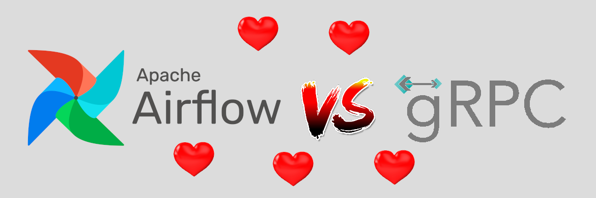

# airflow-grpc-starter

Easy to use [Airflow](https://airflow.apache.org/) & [gRPC](https://grpc.io/) starter project. 

Clone me and get ready to schedule your first gRPC requests !

## Structure

- [`proto/`](./proto): Dummy protobuf service definition (with a simple "ping" service)
- [`src/server`](./src/server): gRPC server implementation in Python
- [`src/airflow`](./src/airflow): Airflow DAG implementation (gets copied to the docker-compose container)

Airflow is started using docker-compose, with the scheduler and the webserver stared in 2 different services.
Python dependencies are added to the Airflow image using a custom [Dockerfile](./Dockerfile).
In order to allow Airflow to communicate with the gRPC server that lives on the host, a 
[`docker-host`](https://registry.hub.docker.com/r/qoomon/docker-host) service is used (it proxies the request to the host).

## Getting started

1. Generate proto files:
```bash
./generate-protos.sh
```

2. Start Airflow using docker-compose (Airflow Web UI will be at [localhost:8084](http://localhost:8084))
```bash
docker-compose up -d
```

3. Create a new gRPC connection. In Web UI, go to **Admin** -> **Connections** -> **Create**, and fill the fields as follows:


Field Name | Value | Description
---------- | ----- | -----------
**Conn id** | `grpc_default` | Connection ID. <br/>Should match the ID specified in your gRPC Operator, in [src/airflow/dags/ping_grpc.py](src/airflow/dags/ping_grpc.py)
**Conn type** | `GPRC Connection` | Connection type.
**Host** | `dockerhost` | gRPC server host. <br/>In this setup, the `dockerhost` service in [docker-compose.yml](./docker-compose.yml) proxies the request from docker to the host (where the server lives).In a real world setup, you may want to set it to a DNS name or an IP.
**Port** | `3170` | gRPC server port.
**Extra** | `{"extra__grpc__auth_type": "NO_AUTH"}` | Extra configuration.<br/>Specify the authentication mechanism, in this case, creates an insecure channel (over HTTP). You may want to use other settings, as [listed here](https://airflow.apache.org/docs/apache-airflow/stable/howto/connection/grpc.html#authenticating-to-grpc).
**Grpc Auth Type** | `NO_AUTH` | gRPC Auth type. <br/>Should match the setting set above.


4. Start the gRPC server
```bash
./start-server.sh
```

5. Manually trigger the `ping_grpc` DAG in Airflow, and check the output in the DAG run logs, you should see the gRPC server's response !

## Useful documentation

- [gRPC Python Documentation](https://grpc.io/docs/languages/python/)
- [Airflow Documentation](https://airflow.apache.org/docs/apache-airflow/stable/index.html)
- [Airflow gRPC Connection Documentation](https://airflow.apache.org/docs/apache-airflow/stable/howto/connection/grpc.html)
- [Airflow gRPC Provider backport](https://pypi.org/project/apache-airflow-backport-providers-grpc/)

## License

[MIT](./LICENSE)
