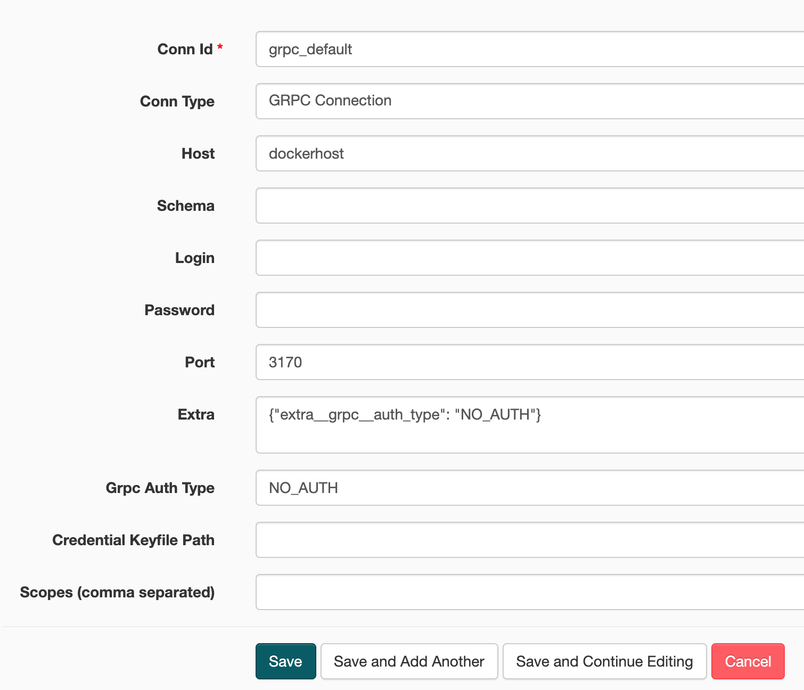

# airflow-grpc-starter

## How to use ?

1. Generate proto files:
```bash
./generate-protos.sh
```

2. Start Airflow
```bash
docker-compose up
```

3. Create a new connection (in Admin -> Connections -> Create), and fill the fields as follows:

Here are the fields:
    - **Conn id:** `grpc_default`
    - **Conn type:** `GPRC Connection`
    - **Host:** `dockerhost`
    - **Port:** `3170`
    - **Extra:** `{"extra__grpc__auth_type": "NO_AUTH"}`
    - **Grpc Auth Type:** `NO_AUTH`


4. Start the gRPC server
```bash
./start-server.sh
```

5. Manually trigger the `ping_grpc` DAG in Airflow, and check the output in the DAG run logs
